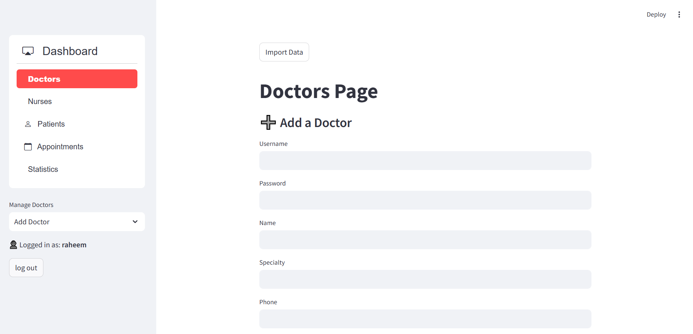
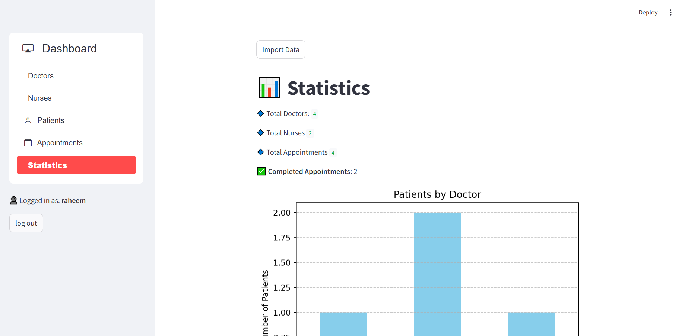
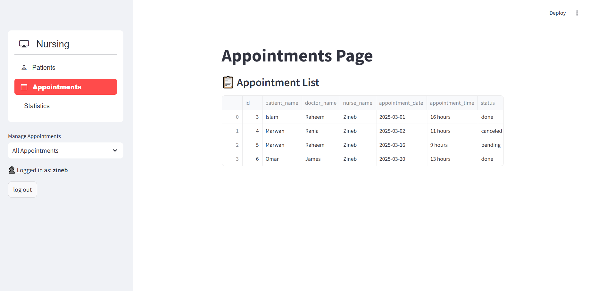
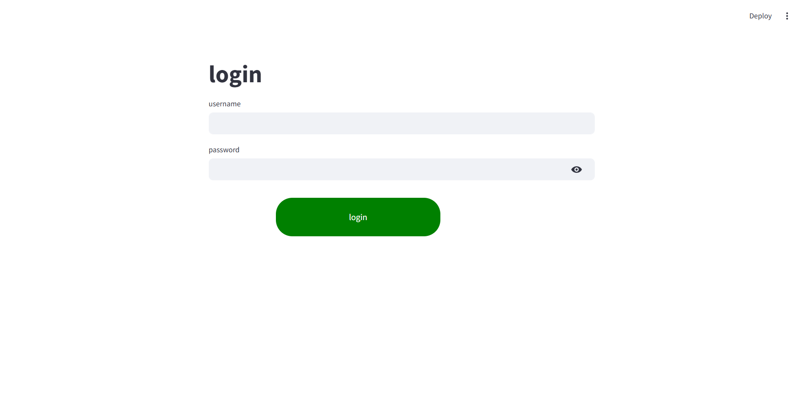
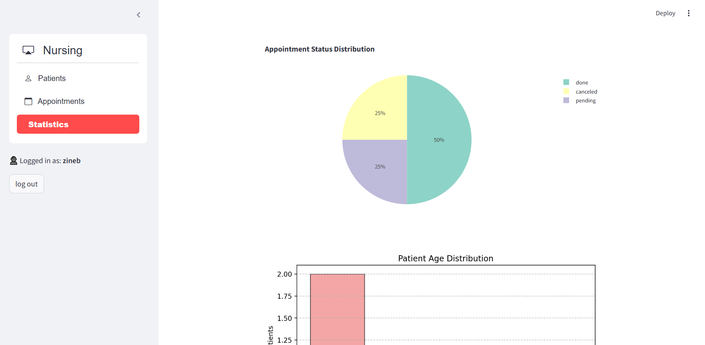

# Doctor Cabinet - Patient Management System

## 🏥 About the Project
Doctor Cabinet is a **Patient Management System** designed to help doctors, nurses, and administrators efficiently manage **patients, appointments, and medical records**. Built with **Python, Streamlit, and MySQL**, this system provides a user-friendly interface for handling patient data and scheduling appointments.

---

## ✨ Features
- 👤 **Patient Management**: Add, update, and delete patient records.
- 📅 **Appointment Scheduling**: Book and manage appointments for doctors and patients.
- 📊 **Data Visualization**: Generate reports and analytics using **Matplotlib** and **Plotly**.
- ✅ **Status Tracking**: Mark appointments as "Completed" or "Cancelled" dynamically.
- 📂 **Export Data**: Download appointment and patient records in **Excel format**.
- 🔄 **Data Import**: Import existing patient and appointment data into the system.

---

## 🛠️ Installation

### **1️⃣ Clone the Repository**
```sh
git clone https://github.com/AbderraheemRmh/Doctor-Cabinet.git
cd Doctor-Cabinet
```

### **2️⃣ Install Dependencies**
```sh
pip install -r requirements.txt
```

### **3️⃣ Set Up MySQL Database**
1. Ensure MySQL is installed and running.
2. Create a database and import the schema from `cabinet.sql`.
3. Update **database credentials** in `database.py`:
```python
DB_HOST = "your_host"
DB_USER = "your_username"
DB_PASSWORD = "your_password"
DB_NAME = "cabinet"
```

### **4️⃣ Run the Application**
```sh
streamlit run login.py
```

---

## 📸 Screenshots
| Dashboard | Nurse Management |
|-----------|----------------------|
|  |  |
|  |  |
|  |  |

---

## 🤝 Contributing
1. **Fork** the repository.
2. **Create a new branch**: `git checkout -b feature-name`
3. **Commit your changes**: `git commit -m "Added new feature"`
4. **Push to GitHub**: `git push origin feature-name`
5. **Create a Pull Request**.

---

## 📜 License
This project is licensed under the **MIT License**.

---

## 🎉 Team Credits
This project was developed collaboratively by a dedicated team. Special thanks to all team members for their hard work and contributions!

